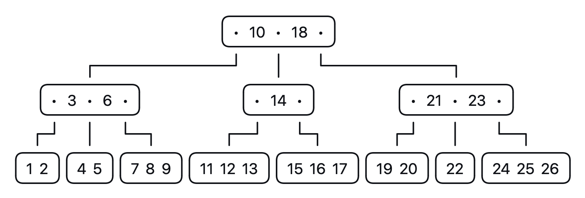
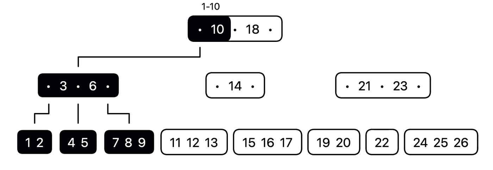
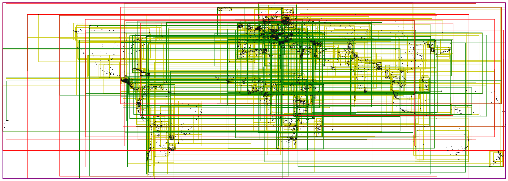
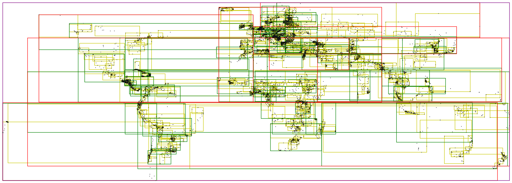
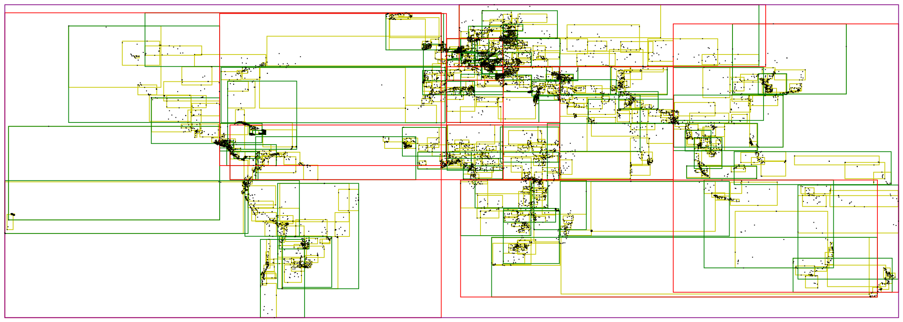

# Spatial B-trees

The <a href="https://en.wikipedia.org/wiki/B-tree">B-tree</a> is an awesome
data structure. Its primary purpose is to maintain an
ordered list of items, where each operation (insert, delete, search) is
guaranteed a time complexity of
<a href="https://en.wikipedia.org/wiki/Time_complexity">O(log n)</a>.

This document describes a new way to extend an existing B-tree for the use of 
multidimensional data. There's currently a whole bunch of existing structures
that can be used for spatial data, including the
[R-tree](https://en.wikipedia.org/wiki/R-tree),
[K-d tree](https://en.wikipedia.org/wiki/K-d_tree),
[Quadtree](https://en.wikipedia.org/wiki/Quadtree), and
[UB-tree](https://en.wikipedia.org/wiki/UB-tree").

This one is a different.

## The Algorithm

A standard B-tree is an ordered tree-based data structure that stores its items
in nodes.

The B-tree has a single root node, which may have children nodes, and those 
children nodes may also have children nodes.

<picture>
  <source media="(prefers-color-scheme: dark)" srcset="assets/spatial-normal-dark.png">
  <source media="(prefers-color-scheme: light)" srcset="assets/spatial-normal-light.png">
  
</picture>

The only change is that we'll now store the bounding box (MBR) information for 
each child node. 
This bounding box will be expanded to include the entire child node tree along 
with the current branch level item at the same index as the child.

<picture>
  <source media="(prefers-color-scheme: dark)" srcset="assets/spatial-animation-dark.gif">
  <source media="(prefers-color-scheme: light)" srcset="assets/spatial-animation-light.gif">
  
</picture>

## Operations

- Insert: Same algorithm as the orginal B-tree. Except now
each bounding box, from leaf to root, will be expanded to make room for
the new item.
- Delete: Also the same as the original, with adjustments from leaf to root.
- Spatial search: Works like an R-tree, where you scan each rectangle
(bounding box) and take intersecting children.

## Key Order

The Spatial B-tree leaves the order of the items up to you. 
This means the quality and performance of searching the tree can vary greatly
by the how this ordering is managed.

For example, let's say you want to store geospatial points where each point
is a tuple that contains at least three fields (id,lat,lon). In a standard
B-tree you could order on 'id', but this may lead to subpar performance because
the 'id' may not necessarily correspond with the (lat,lon). This will 
potentially leave points that are spatially far apart, nearby in the B-tree;
and points that are spatially close, far apart in the B-tree.

Ideally, for best performance you would use a space-filling curve algorithm, 
such as [Hilbert curve](https://en.wikipedia.org/wiki/Hilbert_curve)</a>
or [Z-order curve](https://en.wikipedia.org/wiki/Z-order_curve)</a>, to 
produce a curve value that would be stored along with the 'id'. So your tuple
will look more like (curve,id,lat,lon), where the Spatial B-tree orders on 
(curve,id).

Below is a visualization of different ordering strategies using a dataset 
of [10k cities](../tests/cities.h).

### No ordering

Not great

<picture>
  <source media="(prefers-color-scheme: dark)" srcset="assets/spatial-none-dark.png">
  <source media="(prefers-color-scheme: light)" srcset="assets/spatial-none-light.png">
  
</picture>

### Z-order

Better

<picture>
  <source media="(prefers-color-scheme: dark)" srcset="assets/spatial-zorder-dark.png">
  <source media="(prefers-color-scheme: light)" srcset="assets/spatial-zorder-light.png">
  
</picture>

### Hilbert

Best 🚀

<picture>
  <source media="(prefers-color-scheme: dark)" srcset="assets/spatial-hilbert-dark.png">
  <source media="(prefers-color-scheme: light)" srcset="assets/spatial-hilbert-light.png">
  
</picture>

## Comparison

Structurally the Spatial B-tree is like the
[Counted B-tree](https://www.chiark.greenend.org.uk/~sgtatham/algorithms/cbtree.html)
but is functionally more similar to the 
[R-tree](https://en.wikipedia.org/wiki/R-tree) and the 
[UB-tree](https://en.wikipedia.org/wiki/UB-tree).

<h3>R-tree</h3>

Like the R-tree each child rectangle is the minimum bounding
rectangle of the entire child tree.

A difference is that the R-tree stores all items at the leaf level, just 
like a B+Tree. While the Spatial B-tree stores items in the branches and leaves,
just like a standard B-tree.

Another difference is that during insertion the R-tree and it's variants, such
as the R*tree, go to great lengths to determine the best ordering of the branch
rectangles and items. Whenever a new item is inserted into an R-tree, from root
to leaf, a complicated algorithm is used to choose the best child node to insert 
the item into. Depending the quality of that algorithm, which isn't always 
identical with every implementations, the performance of inserting and
searching can vary greatly.

The Spatial B-tree on the other hand inserts items exactly like a standard
B-tree, by ordering on the item's key. As <a href="#key-order">stated above</a>,
this means that you must choose your keys wisely.

One R-tree variant worth noting is the 
<a href="https://en.wikipedia.org/wiki/Hilbert_R-tree">Hilbert R-tree</a>, which 
stores items in linear order using a Hilbert curve. This provides excellent 
search performance compared to other R-trees, and its ordering of items is very 
similar to a Spatial B-tree using a Hilbert curve in its key. But the 
structure is a bit more complicated that a traditional R-tree, it must 
track both LHVs (Largest Hilbert Value) and MBRs (Minimum Bounding Rectangle) 
for leaves and branches. This leads to extra work to maintain. And insertions
and deletions are generally less efficient than a Spatial B-tree.

<h3>UB-tree</h3>

The Spatial B-tree and UB-tree both store items linearly based on the key. 

The UB-tree stores all items in the leaves (just like the R-tree), while the 
Spatial B-tree stores items in branches and leaves, like a standard B-tree.

Another difference is that the UB-tree is designed to order on a Z-order curve, 
while the Spatial B-tree doesn't care, leaving it up to you what the ordering 
is. This opens up the Spatial B-tree to different strategies, such as Z-order 
or Hilbert or something else.

Also the UB-tree does not store the MBRs (Minimum Bounding Rectangle) and
thus cannot scan the tree for intersections like an R-tree and Spatial B-tree.
Instead it needs to use an algorithm which basically looks
at ranges of the Z-curve to find nearby nodes that overlap a target area.
Effectively working kind of like the
<a href="https://www.ibm.com/docs/en/db2/11.5?topic=concepts-geohashes-geohash-covers">Geohash covers</a>
algorithm.

In general the Spatial B-tree is designed to search like an R-tree but have the
simplicity of a standard B-tree.

One more thing, the Spatial B-tree and UB-tree guarantee stable ordering 
of items, meaning that no matter what the order of inserts and deletes for a
specific set of items might be, those items will always be returned in the same
order when searching. R-tree ordering is unstable. This may be an important
detail if you desire deterministic results.

<h2>Implementation</h2>

You can use the Spatial B-tree today using the 
<a href="https://github.com/tidwall/bgen">Bgen B-tree Generator</a> for C.

